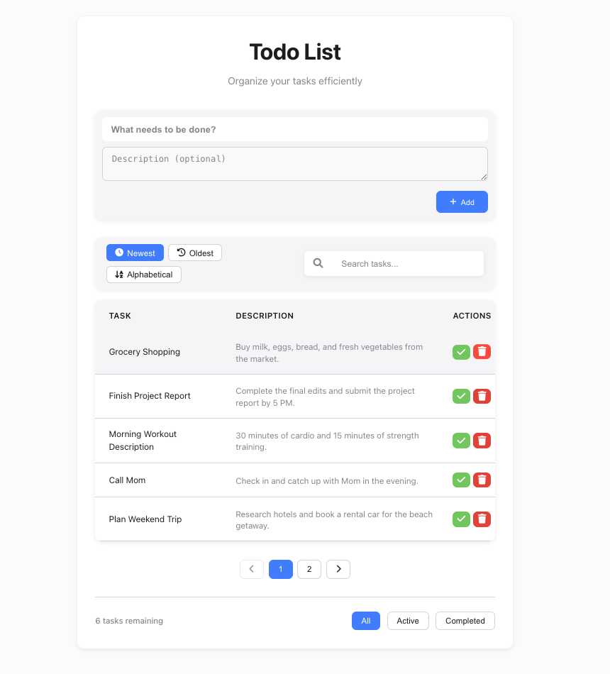

# Apple-Style Todo List App

A modern, responsive, and feature-rich Todo List web application inspired by Apple's design language. Built with vanilla JavaScript, HTML, and CSS.

## Features

- 📝 **Add Tasks** with title and description
- 🔍 **Search** tasks in real-time
- 🗂️ **Sort** tasks (Newest, Oldest, Alphabetical)
- 🏷️ **Filter** by All, Active, Completed
- ✅ **Mark as Complete/Undo**
- 🗑️ **Delete** tasks
- 🚫 **No duplicate titles** (case-insensitive)
- 📄 **Description** as a separate column
- 📄 **Pagination** for large lists
- 📦 **LocalStorage** persistence
- 🖱️ **Drag & Drop** reordering (UI only)
- 📱 **Responsive** and mobile-friendly
- 🍏 **Apple-inspired UI/UX**

## Screenshots



## Getting Started

### 1. Clone the repository
```bash
git clone <your-repo-url>
cd <project-directory>
```

### 2. Open in your browser
Just open `todo list/index.html` in your favorite browser. No build step or server required!

## Project Structure

```
todo list/
├── assets/
│   ├── css/
│   │   └── style.css
│   └── js/
│       ├── app.js
│       ├── task.js
│       └── ui.js
├── index.html
└── README.md
```

## Customization
- **Change theme:** Edit CSS variables in `assets/css/style.css`.
- **Add features:** Extend `assets/js/task.js` and `assets/js/ui.js`.

## Credits
- UI inspired by Apple and [Apple Human Interface Guidelines](https://developer.apple.com/design/human-interface-guidelines/)
- Icons from [Font Awesome](https://fontawesome.com/)

## License

This project is open source and free to use under the [MIT License](LICENSE). 